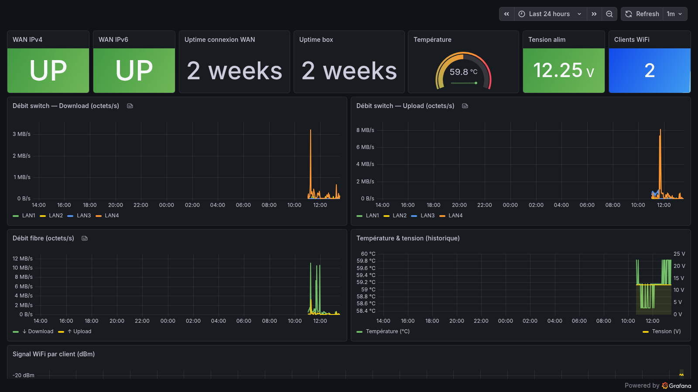

# SFR Box Exporter

[](https://ko-fi.com/chabnco)

Prometheus exporter for the **SFR NB6VAC** (and likely other NB6 variants) home router.  
Scrapes the box local API and web interface to expose metrics in Prometheus format.



## Metrics

| Metric | Description |
|--------|-------------|
| `sfr_box_wan_up` | WAN IPv4 status (1=up, 0=down) |
| `sfr_box_wan_uptime_seconds` | WAN connection uptime |
| `sfr_box_wan_ipv6_up` | WAN IPv6 status (1=up, 0=down) |
| `sfr_box_uptime_seconds` | Box uptime |
| `sfr_box_temperature_celsius` | Box CPU temperature |
| `sfr_box_voltage_volts` | Power supply voltage |
| `sfr_box_switch_rx_bytes{port}` | Switch port bytes received (LAN1–4, FIBRE) |
| `sfr_box_switch_tx_bytes{port}` | Switch port bytes sent (LAN1–4, FIBRE) |
| `sfr_box_wifi_clients_total` | Number of connected WiFi clients |
| `sfr_box_wifi_signal_dbm{mac}` | WiFi signal per client in dBm |
| `sfr_box_scrape_success` | 1 if last scrape succeeded |

> **Note:** WAN and system metrics do **not** require authentication.  
> Switch port stats and WiFi client metrics require `BOX_PASS`.

## Requirements

- Docker + Docker Compose
- Prometheus (existing stack)
- The box admin password (printed on the label under the box, or set in the web UI at `http://192.168.1.1`)

## Quick start

### 1. Copy the exporter script

```bash
mkdir -p /opt/docker/sfr-box-exporter
cp exporter.py /opt/docker/sfr-box-exporter/exporter.py
```

### 2. Edit `docker-compose.yml`

Set your password in the `BOX_PASS` environment variable:

```yaml
environment:
  - BOX_PASS=your_box_admin_password
```

If your Prometheus network has a different name, update the `networks` section.

### 3. Start the exporter

```bash
docker compose up -d
```

Check it's running:

```bash
curl http://localhost:9101/metrics | grep sfr_box
```

### 4. Add the Prometheus scrape job

Add the contents of `prometheus-job.yml` to your `prometheus.yml` under `scrape_configs`:

```yaml
  - job_name: 'sfr-box'
    scrape_interval: 30s
    static_configs:
      - targets: ['sfr-box-exporter:9101']
```

Then reload Prometheus:

```bash
docker kill --signal=SIGHUP prometheus
```

### 5. Import the Grafana dashboard

In Grafana → Dashboards → Import → Upload `grafana/dashboard.json`.  
Select your Prometheus datasource when prompted.

## Authentication

The box uses a challenge/response login (`HMAC-SHA256`).  
The exporter handles this automatically — just provide `BOX_PASS`.

The default admin password is the **WPA key printed on the label** under the box.

## Environment variables

| Variable | Default | Description |
|----------|---------|-------------|
| `BOX_URL` | `http://192.168.1.1` | Box admin URL |
| `BOX_USER` | `admin` | Admin username |
| `BOX_PASS` | *(empty)* | Admin password (required for switch/WiFi metrics) |
| `EXPORTER_PORT` | `9101` | Port to expose metrics on |

## Compatibility

Tested on **NB6VAC-FXC-r2** (firmware R4.0.47h5) with FTTH.  
The unauthenticated metrics (`wan.getInfo`, `system.getInfo`) should work on any NB6 model.  
The switch/WiFi scraping depends on the HTML structure of `/state/lan` — it may need adjustment for other firmware versions.

## License

MIT
